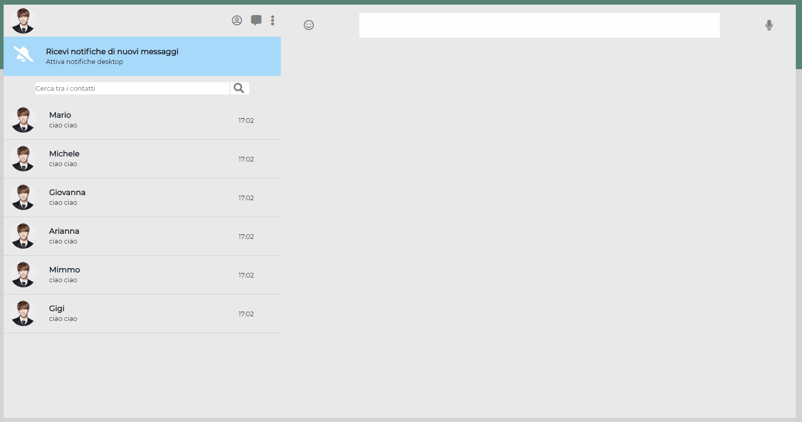
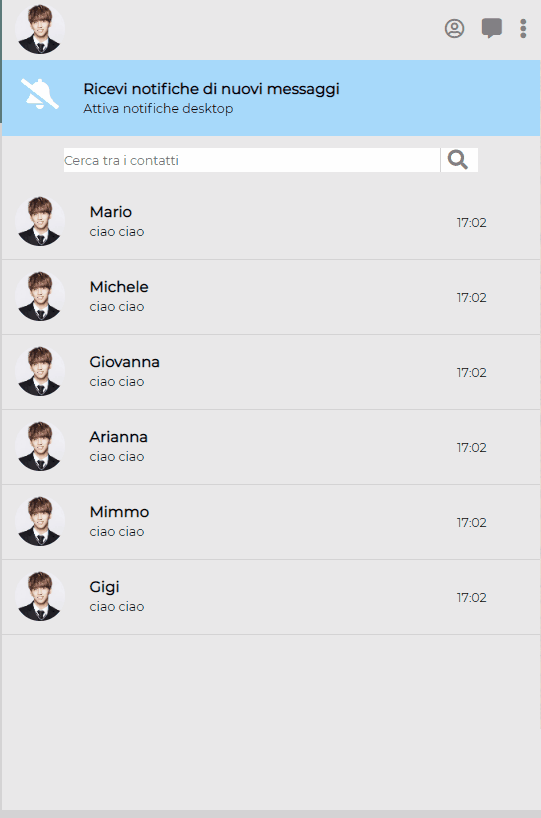

# Boolzapp

<h1>Whatsapp Web Clone</h1>

This project aims to replicate the web version of Whatsapp using <b>HTML, CSS e JQUERY</b>.  
There are several chats on the left which can be opened and all the details can be read.  
the user can read, send messages and receive a default reply.  

  
  
  
Moreover, using the search bar it is possible to search for the name of a contact among those available.
 
 
